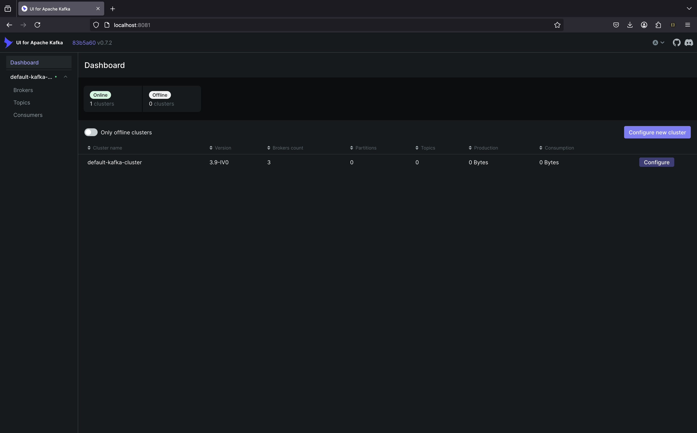
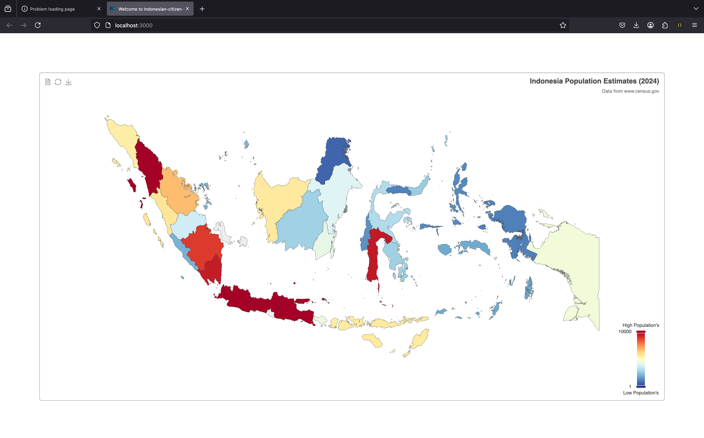

# Kafka Docker Setup

This repository contains a Docker Compose configuration to run an Apache Kafka cluster with multiple controllers and brokers.

## Prerequisites

- [Docker](https://www.docker.com/get-started) installed
- [Docker Compose](https://docs.docker.com/compose/install/) installed

## Setup

### Running Kafka Cluster

To start the Kafka cluster, navigate to the `docker` folder and run:

```sh
./scripts/run-kafka.sh
```

This will start:
- 3 Kafka controllers (`controller-1`, `controller-2`, `controller-3`)
- 3 Kafka brokers (`broker-1`, `broker-2`, `broker-3`)
- A dedicated network (`kafka-network`)

### Stopping Kafka Cluster

To stop and remove all running containers, run:

```sh
./scripts/stop-kafka.sh
```

### Viewing Logs

To view logs of the Kafka cluster, run:

```sh
./scripts/kafka-logs.sh
```

This will output logs from all running Kafka services.

## Kafka Configuration

The `docker/docker-kafka-compose.yaml` file defines the following:

- **Controllers** (Nodes 1, 2, and 3) handle metadata management.
- **Brokers** (Nodes 4, 5, and 6) handle message processing.
- **Kafka Network** (`kafka-network`) ensures communication between containers.

## Ports Mapping

| Broker    | Internal Port | External Port |
|-----------|--------------|--------------|
| broker-1  | 9092         | 29092        |
| broker-2  | 9092         | 39092        |
| broker-3  | 9092         | 49092        |

## Environment Variables

- `KAFKA_NODE_ID`: Unique identifier for each Kafka node.
- `KAFKA_PROCESS_ROLES`: Defines whether a node is a `controller` or `broker`.
- `KAFKA_LISTENERS`: Defines listener endpoints.
- `KAFKA_ADVERTISED_LISTENERS`: Defines how brokers advertise their services.
- `KAFKA_CONTROLLER_QUORUM_VOTERS`: Defines the list of controller nodes.
- `KAFKA_TOPICS`: Default topics to create on startup.

## Manage Kafka Using Kafka

once the start up done, the admin ui for managing kafka service can be accessed on `http://localhost:8081`
its also configure the default kluster, bind into to `broker-1` `broker-2` `broker-3`



click to list `defaulty-kafka-cluster` to configure kluster if needed


To create topics called `nest-kafka-topic` go to `Topics` side menu and click add a topic


create new topic `nest-kafka-topic` 


Once done it will list the topic and partition , your topic are reaady to be used


Go to `Consumer`  menu to list all available connected consumers (for mmonitoring message)


## Running Producer & Consumer 

Before running consumer, install all dependency using `npm` or `pnpm` or `yarn`, its also installed dev dependency Nx Library whic used for managing monorepo for multiple projects at one repository and for running producer or consumer through terminal

using `npm`
```sh
npm i

```
using `pnpm`
```sh
pnpm i

```
using `npm`
```sh
yarn install
```

after install, these command for running producer and consumr will be available 

- `kafka-consumer:dev` Run consumer command
- `kafka-producer:dev:interactive` Run producer command interactively
- `kafka-producer:dev:file` Run producer command whic use file for defining message to broadcast through kafka


To run consumer : 

using `pnpm`
```sh
pnpm exec nx run kafka-nest:kafka-consumer:dev 
```

using `npm` / `npx`
```sh
npx nx run kafka-nest:kafka-consumer:dev

```

using `yarn`
```sh
yarn nx run kafka-nest:kafka-consumer:dev
```

if prompted to enter the topic name : `nest-kafka-topic`, then press enter 


after running consumer, youre ready to produce any message too the broker and monitor the message through `kafka-ui` at `localhost:8081`

To run producer (interactive producer) :
```sh
pnpm exec nx run kafka-nest:kafka-producer:dev:interactive
```

using `npm` / `npx`
```sh
npx nx run kafka-nest:kafka-producer:dev:interactive

```

using `yarn`
```sh
yarn nx run kafka-nest:kafka-producer:dev:interactive
```


if prompted to enter the topic name : `nest-kafka-topic`, then press enter 


after entering topics, it wil prompt to enter any message, try it to entering any message then enter to send 


A succes wil display into terminal 


check to consumer to see the message 


try send another message 


check again through the consumer 


verify message are broadcast to kafka in kafka-ui admin panel


Press `ctrl+c` to close producer and consumer

## Running Next Js Project (Indonesia Population)

To run next js indonesia population charts simply call :

```sh
pnpm exec nx run kafka-nest:kafka-producer:dev:interactive
```

using `npm` / `npx`
```sh
npx nx run kafka-nest:kafka-producer:dev:interactive

```

using `yarn`
```sh
yarn nx run kafka-nest:kafka-producer:dev:interactive
```

Then navigate to 
```   
- Local:        http://localhost:3000
- Network:      http://192.168.51.100:3000
```
The chart will show



## Notes

- Brokers are accessible externally via `localhost:29092`, `localhost:39092`, and `localhost:49092`.
- The `scripts` folder contains helper scripts for managing the Kafka cluster.
- Ensure scripts have execute permissions by running:
  ```sh
  chmod +x scripts/*.sh
  ```
- If the error raised during setup or producer/consumer runtime, try check the logs of kafka service, all logs placed inside `./logs` folder

## License

This project is licensed under the MIT License.

